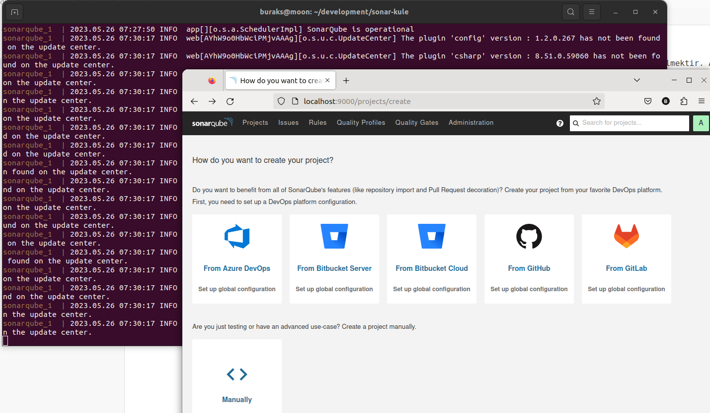

# Sonar-Kule

Teknik borcun oluşturduğu problemlerden kurtulmanın önemli adımlarından birisi yüksek kalitede kod yazabilmektir. Aynı problemi çözmek için birden fazla yol olduğundan ortak standartlarda buluşmak önemlidir. Eskiden kod yazma standartlarına ilişkin dokümanları kullanırdık. Ancak günümüzün gelişmiş IDE'leri ve uygulama geliştirme platformları, ideal kodlama için gerekli uyarıları zaten vermekte. Elbette kod tabanı çok eskiye dayanan sistemlerde bu yeterli olmayabilir. Hatta CI hattında koşacak bir kod kontrol aracı, teknik borç oluşmadan kaliteyi kontrol altına almamızı garanti edebilir. Daha önceden .Net Framework tarafında SonarQube kullanımını ele almak için [Project-Denver](https://github.com/buraksenyurt/project-denver) isimli legacy bir kobay projeyi ele almıştım. Bu repoda ise güncel .Net platformunda kullanımını inceleyip sıklıkla yapılan C# kod ihlallerini incelemeye çalışacağım.

## Ön Hazırlıklar

Örnekleri Ubuntu 22.04 sistemimde deniyorum. Normalde bir Sonarqube sunucusuna ihtiyacımız olur ancak resmi [dokümantasyonda](https://docs.sonarqube.org/9.7/setup-and-upgrade/install-the-server/) güzel bir docker-compose dosyası var. Dolayısıyla sistemde docker yüklü ise fazla zahmete girmeden sonarqube denemelerine başlanabilir.

```bash
# Kendi ubuntu sistemimde bu imajı denerken 
# bootstrap check failure [1] of [1]: max virtual memory areas vm.max_map_count [65530] is too low, increase to at least [262144]
# şeklinde bir hata aldım.
# Bu nedenle aşağıdaki komutla istenen bellek aranını artırdım. Tabii makinenin fanı biraz bağırmaya başladı :D
sysctl -w vm.max_map_count=262144

sudo docker-compose up
```

Bu işlemlerin ardından Moon'da, localhost:9000 adresine girdiğimde Sonarqube'e erişebildiğimi gördüm.



__DEVAM EDECEK__
