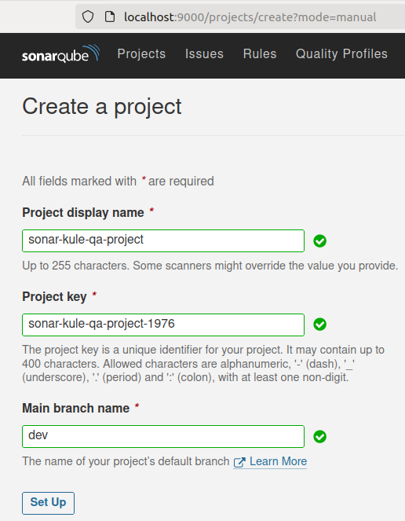
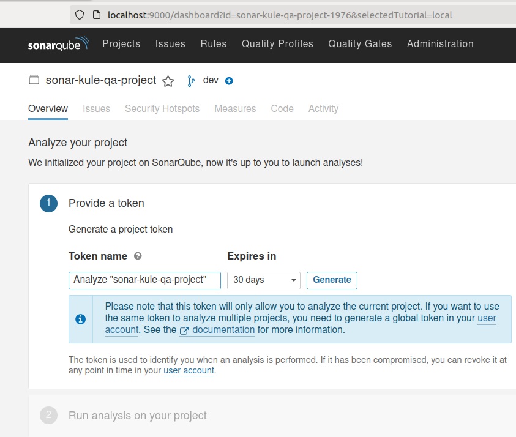
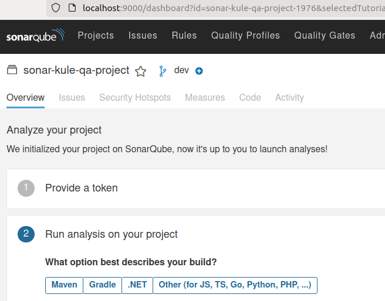
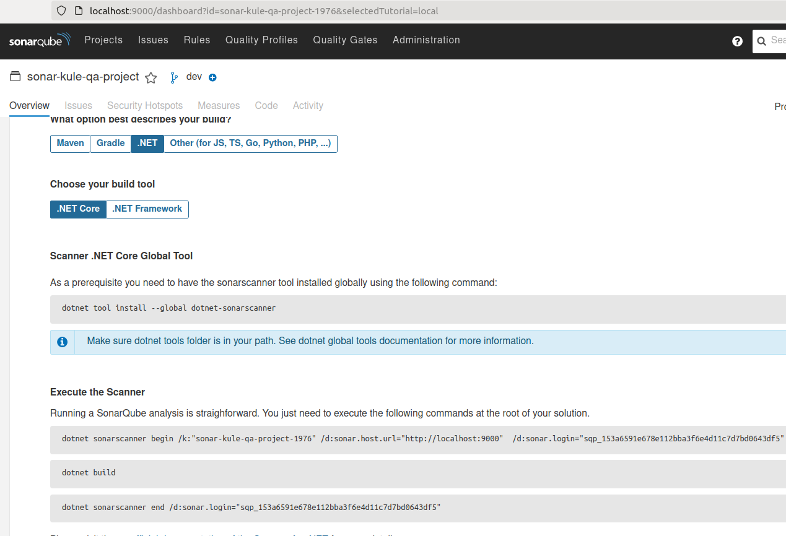
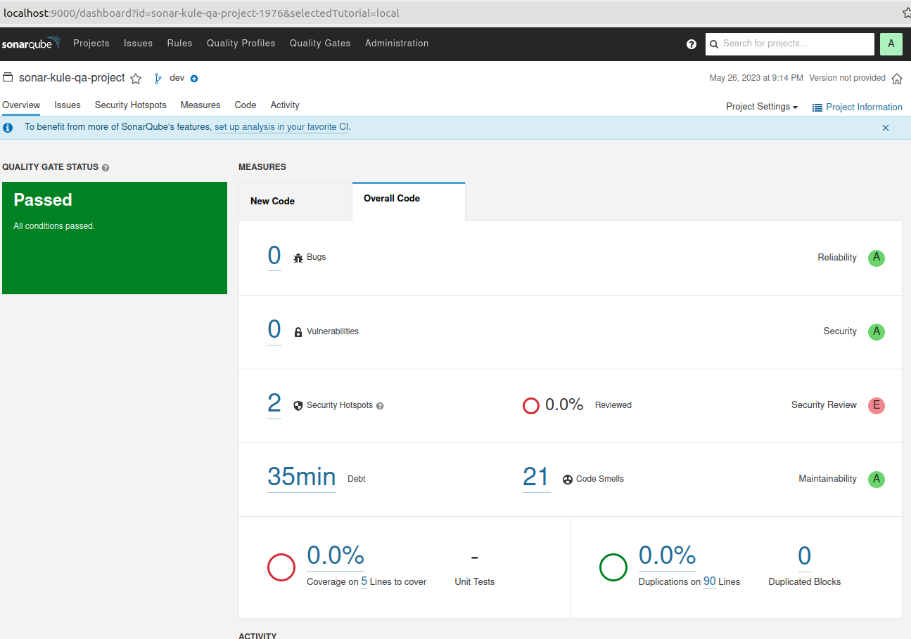
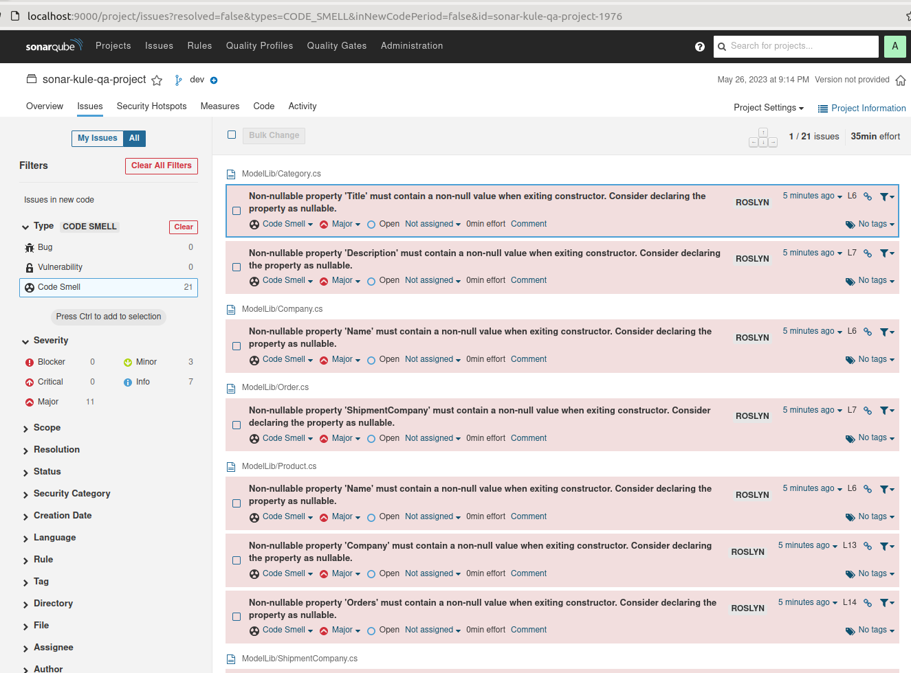
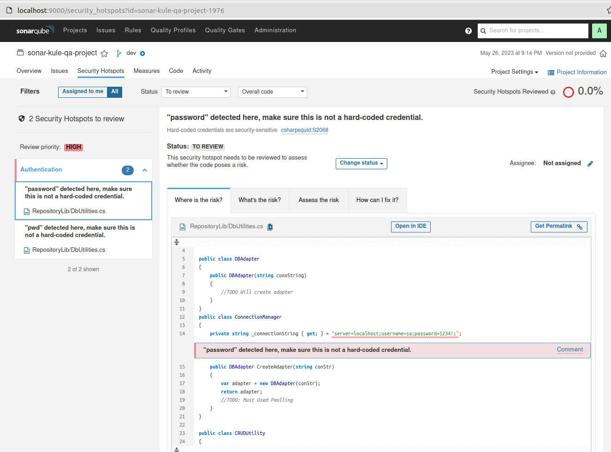

# Sonar-Kule

Teknik borcun oluşturduğu problemlerden kurtulmanın önemli adımlarından birisi yüksek kalitede kod yazabilmektir. Aynı problemi çözmek için birden fazla yol olduğundan ortak standartlarda buluşmak önemlidir. Eskiden kod yazma standartlarına ilişkin dokümanları kullanırdık. Ancak günümüzün gelişmiş IDE'leri ve uygulama geliştirme platformları, ideal kodlama için gerekli uyarıları zaten vermekte. Elbette kod tabanı çok eskiye dayanan sistemlerde bu yeterli olmayabilir. Hatta CI hattında koşacak bir kod kontrol aracı, teknik borç oluşmadan kaliteyi kontrol altına almamızı garanti edebilir. Daha önceden .Net Framework tarafında SonarQube kullanımını ele almak için [Project-Denver](https://github.com/buraksenyurt/project-denver) isimli legacy bir kobay projeyi ele almıştım. Bu repoda ise güncel .Net platformunda kullanımını inceleyip sıklıkla yapılan C# kod ihlallerini incelemeye çalışacağım.

## Ön Hazırlıklar

Örnekleri Ubuntu 22.04 sistemimde deniyorum. Sistemde .Net 7 sürümü yüklü. Normalde bir Sonarqube sunucusuna ihtiyacımız olur ancak resmi [dokümantasyonda](https://docs.sonarqube.org/9.7/setup-and-upgrade/install-the-server/) güzel bir docker-compose dosyası var. Dolayısıyla sistemde docker yüklü ise fazla zahmete girmeden sonarqube denemelerine başlanabilir.

```bash
# Kendi ubuntu sistemimde bu imajı denerken 
# bootstrap check failure [1] of [1]: max virtual memory areas vm.max_map_count [65530] is too low, increase to at least [262144]
# şeklinde bir hata aldım.
# Bu nedenle aşağıdaki komutla istenen bellek aranını artırdım. Tabii makinenin fanı biraz bağırmaya başladı :D
sysctl -w vm.max_map_count=262144

sudo docker-compose up
```

Bu işlemlerin ardından Moon'da, localhost:9000 adresine girdiğimde Sonarqube'e erişebildiğimi gördüm.


## Sonarqube Tarafında Proje Oluşturulması

Kod tarafının taramasını başlatmadan önce, ölçümlerin yollanacağı bir projenin SonarQube tarafında oluşturulması gerekiyor. Yeni arabirimdeki seçeneklere göre github, gitlab, bitbucket, azure vb kod repolarını seçmemiz mümkün. Ben Manually seçeneği ile ilerliyorum. Burada hangi branch ile çalışacağımız da önemli. Çalışmada ihlaller içeren bir kod tabanına ihtiyacımız var. Bunların dev isimli bir branch'te toplandığını düşünebiliriz.



Bu adımdan sonra bazı seçenekler gelecektir. Locally ile devam edebiliriz. Ve sonrasında aşağıdaki seçimlerle devam edebiliriz.



Bu kısımca bir key üretilir. Bu key bilgisi komut satırından yapacağımız taramalar için de gerekli olacaktır.



Şimdi hangi platform için bu projeyi kullanacağımızı belirtiyoruz. .Net platformunu ve ardından .Net Core'u seçmemiz bu çalışma için yeterli. Kalan kısımda SonarQube neler yapmamız gerektiğini zaten adım adım tarifliyor.



Komut satırından tarama işlemini başlatmak için dotnet-sonarscanner aracını global olarak yükleyebiliriz. Ardından proje klasöründe yine dokümanın bizim için hazırladığı komutları çalıştırmak yeterli olacaktır.

```bash
# Tool install adımı
dotnet tool install --global dotnet-sonarscanner

# projenin root klasöründe dev branch'indeyken çalıştıracağımız komut
# tabii key değerleri benim sistemim için üretilmiştir. Siz kendi sisteminizde üretilen proje adı ve key değerlerini kullanmalısınız.
dotnet sonarscanner begin /k:"sonar-kule-qa-project-1976" /d:sonar.host.url="http://localhost:9000"  /d:sonar.login="sqp_153a6591e678e112bba3f6e4d11c7d7bd0643df5"
# Tarayıcıyı başlattıktan sonra projeyi build ederiz
dotnet build
# ve tarama işleminin sonlandırılması komutunu veririz
dotnet sonarscanner end /d:sonar.login="sqp_153a6591e678e112bba3f6e4d11c7d7bd0643df5"
```

## [DAY 1] Solution Oluşturulması ve İlk Çıktılar

Deneme amaçlı bir Solution geliştiriyoruz. Dev branch'te çalışmaya özen gösteriyorum. Normalde derlenebilir bir proje ama kod tarafında saçmalamaya çalıştığım bir sürü yer var. Sırf sonar'a iş çıkarmak için. Keh keh key...Başlangıç açısından bu şekilde tarama yapmak önemli. Yeni kodlar ekledikçe biraz daha teknik borcu yükseltmeye ve çeşitlendirmeye çalışabiliriz. 30 günlük bir süre içerisinde de ilerleyişimizi görürüz. İlk sonuçlar şöyle gerçekleşmiştir.



Daha şimdiden çoraplar kokmaya başladı... Iyyyykkk! :P



Hatta bilerek yazdığımız güvenlik açıkları da yakalanır.



## [DAY 2]

Kodda saçmalamaya devam edip build olan ama teknik borç yükünün artmasına neden olan eklemeler sonrasındaki durum ise şöyle olacaktır.

__GELECEK__

## [DAY 3]

__GELECEK__

## [DAY 4]

__GELECEK__

## [DAY 5]

__GELECEK__

## [DAY 6]

__GELECEK__

## [DAY 7]

__GELECEK__